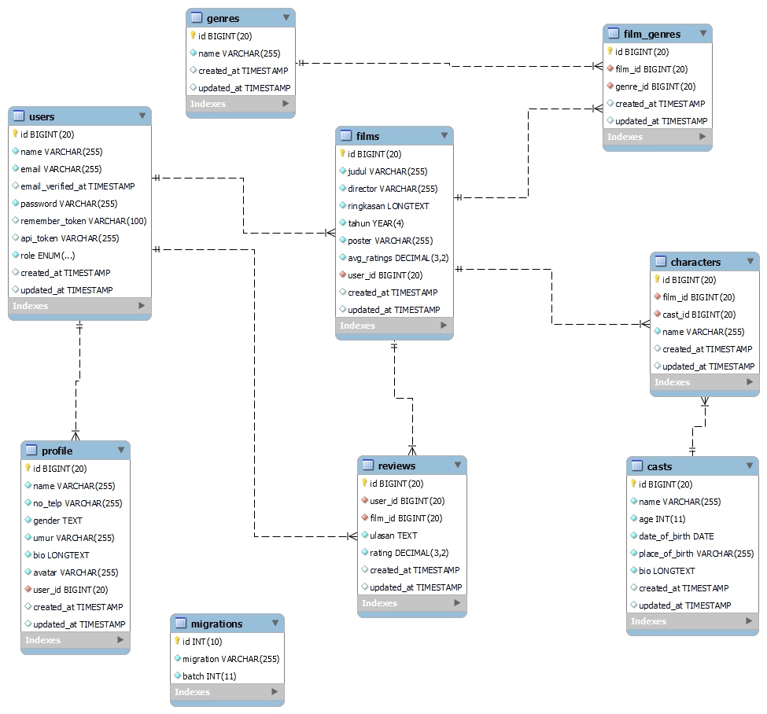

## Deskripsi Proyek

"ScreenScore" adalah sebuah aplikasi backend yang menyediakan layanan untuk menangani informasi terkait film, ulasan, genre, pemain, dan karakter. Aplikasi ini memungkinkan pengguna untuk melihat daftar film, menambahkan ulasan, melihat ulasan film, dan melakukan berbagai operasi CRUD terkait data film, genre, pemain, dan karakter.

## Kelompok Kerja
- Ikhsan Fauzan
- Nur Hidayat
- Riyan

## Fitur Utama

1. **Manajemen Film**: Pengguna dapat melihat daftar film, menambahkan film baru, memperbarui detail film, dan menghapus film yang ada.
2. **Manajemen Ulasan**: Pengguna dapat menambahkan ulasan untuk film tertentu, melihat ulasan yang telah dibuat, dan menghapus ulasan yang sudah tidak diperlukan.
3. **Manajemen Genre**: Pengguna dapat melihat daftar genre, menambahkan genre baru, memperbarui detail genre, dan menghapus genre yang sudah tidak diperlukan.
4. **Manajemen Pemain**: Pengguna dapat melihat daftar pemain, menambahkan pemain baru, memperbarui detail pemain, dan menghapus pemain yang sudah tidak diperlukan.
5. **Manajemen Karakter**: Pengguna dapat melihat daftar karakter dalam film, menambahkan karakter baru, memperbarui detail karakter, dan menghapus karakter yang sudah tidak diperlukan.

## ERD Desain

### Endpoint API

#### Films

- **GET /api/films**: Mendapatkan daftar semua film.
- **POST /api/films**: Menambahkan film baru.
- **GET /api/films/{id}**: Mendapatkan detail film berdasarkan ID.
- **PUT /api/films/{id}**: Memperbarui detail film berdasarkan ID.
- **DELETE /api/films/{id}**: Menghapus film berdasarkan ID.

#### Reviews

- **GET /api/reviews**: Mendapatkan daftar semua ulasan.
- **POST /api/reviews/films/{idFilms}**: Menambahkan ulasan baru untuk film tertentu.
- **GET /api/reviews/{id}**: Mendapatkan detail ulasan berdasarkan ID.
- **PUT /api/reviews/films/{idFilms}**: Memperbarui ulasan untuk film tertentu.
- **DELETE /api/reviews/{id}**: Menghapus ulasan berdasarkan ID.

#### Genres

- **GET /api/genres**: Mendapatkan daftar semua genre.
- **POST /api/genres**: Menambahkan genre baru.
- **GET /api/genres/{id}**: Mendapatkan detail genre berdasarkan ID.
- **PUT /api/genres/{id}**: Memperbarui detail genre berdasarkan ID.
- **DELETE /api/genres/{id}**: Menghapus genre berdasarkan ID.

#### Casts

- **GET /api/casts**: Mendapatkan daftar semua pemain.
- **POST /api/casts**: Menambahkan pemain baru.
- **GET /api/casts/{id}**: Mendapatkan detail pemain berdasarkan ID.
- **PUT /api/casts/{id}**: Memperbarui detail pemain berdasarkan ID.
- **DELETE /api/casts/{id}**: Menghapus pemain berdasarkan ID.

#### Characters

- **GET /api/characters**: Mendapatkan daftar semua karakter dalam film.
- **POST /api/characters**: Menambahkan karakter baru.
- **GET /api/characters/{id}**: Mendapatkan detail karakter berdasarkan ID.
- **PUT /api/characters/{id}**: Memperbarui detail karakter berdasarkan ID.
- **DELETE /api/characters/{id}**: Menghapus karakter berdasarkan ID.

### Cara Penggunaan

1. Unduh atau klon repository.
2. Instal semua dependensi dengan menjalankan `composer install`.
3. Salin file `.env.example` menjadi `.env` dan sesuaikan pengaturan database.
4. Jalankan migrasi database dengan menjalankan `php artisan migrate`.
5. Jalankan seeder dengan menjalankan `php artisan db:seed`.
6. Jalankan aplikasi dengan perintah `php -S localhost:8000 -t public`.

Sekarang, aplikasi "ScreenScore" siap digunakan untuk mengelola data film dan ulasan. Silakan jelajahi dan gunakan API sesuai kebutuhan Anda.